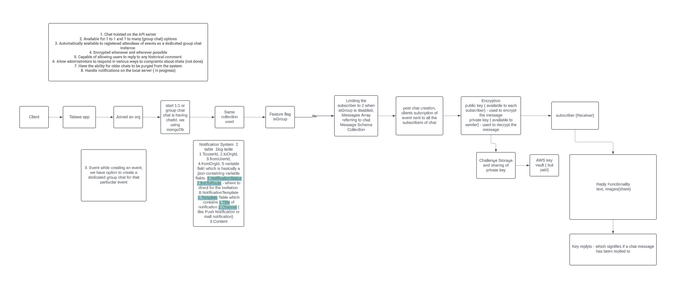

## project
The aim of the project is to develop a self hosted chat for Talawa which facilitates communication amongst users and notifications. Key deliverables of the project are: 
    1. Chat hoisted on the API server 
    2. Available for 1 to 1 and 1 to many (group chat) options 
    3. Automatically available to registered attendees of events as a dedicated group chat instance. 
    4. Encrypted whenever and wherever possible 
    5. Capable of allowing users to reply to any historical comment. 
    6. Allow administrators to respond in various ways to complaints about chats. 
    7. Have the ability for older chats to be purged from the system 8. Handle notifications on the local server

## project flow

## Future Development Scope
- Encryction-decryption logic could be improvised

## contributor
[Disha Taneja](https://github.com/disha1202)
