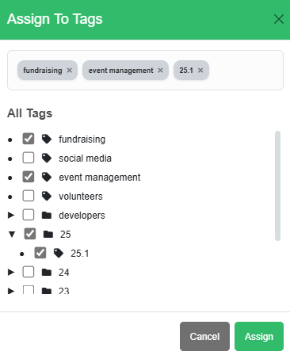
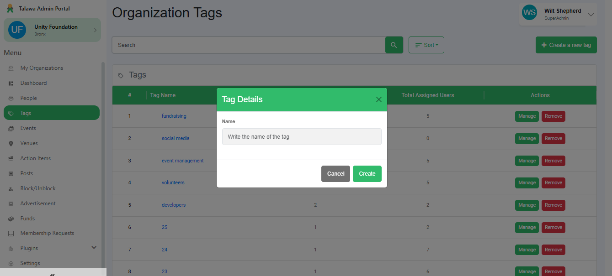
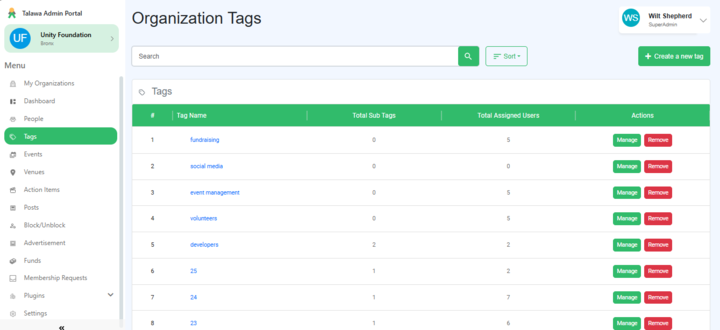
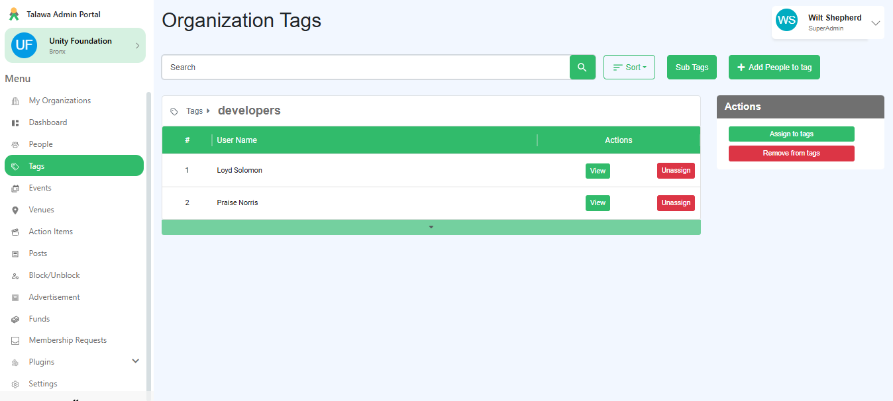
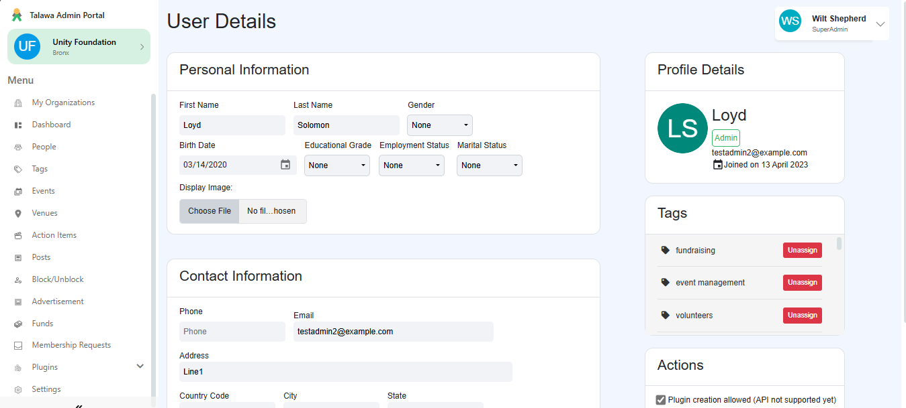
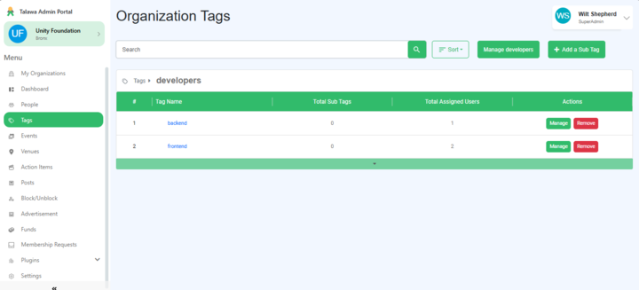
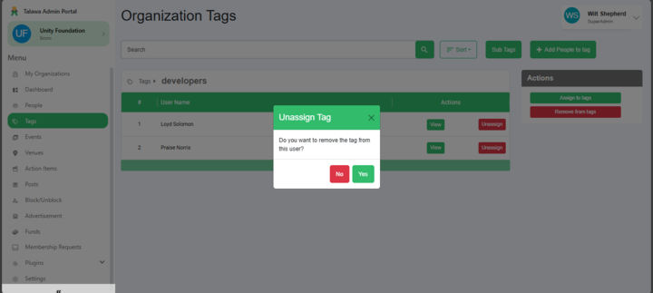
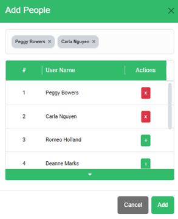

## Project Idea
At present, Talawa lacks a robust Tag Management System. 
While the basic CRUD functionalities for user-specific tags have been implemented in the backend,
these have not been incorporated into the frontend. 
Furthermore, the project does not currently support tags for other 
objects such as Events, Posts, Venues, etc. This proposal aims to enhance the tag management features, 
making them more effective and appealing. This will be achieved by 
improving the functionalities of user tags (for example, by adding support for hierarchical tags, 
automatic tags, group tag operations, etc.), and by establishing additional object-tag relations, 
such as Event tags, Post tags, etc.

## Changes done during GSoC'24
- functionality to add parent-child tag
- CRUD operations based on tags
- Tag management (assignment-unassignment)
- Tag search functionality
- Filter user list owning the tag

## Future Development Scope

## Contributor
[Meetual Rathore](https://github.com/meetulr)