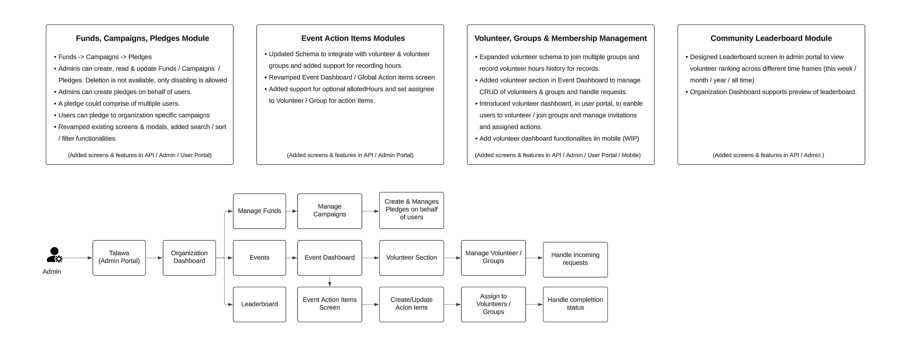
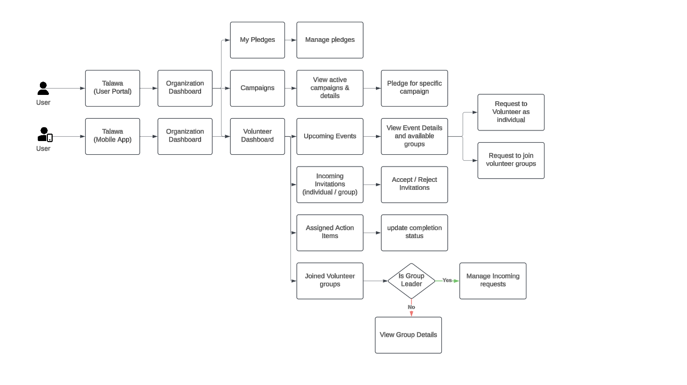

## Project
Talawa Mobile, even though being a crucial part in the Talawa Suite of products, lags in implementation of various features related to events, fund campaigns, pledges and tags. Even some other features have old implementations leading to failing queries.
This project aims to bring Talawa Mobile application up to par with functionalities implemented in Talawa web User portal and Talawa API. 
The project will add screens/components (conforming to Talawa UI/UX) to access following 
    1. New event related features (attendees, Action Items, Event Agenda, Event Volunteers), 
    2. Fund related features (Fund Campaigns, pledges) 
    3. Tags (filtering\searching via user tags/event tags/ post tags). 
    4. Apart from adding screens/components and implementing new features fixing issues and bugs plaguing already implemented features due to older implementation of GraphQL queries & mutations.

## Work Flow

## Future Development Scope

## Contributor
[Glen Dsouza](https://github.com/GlenDsza)